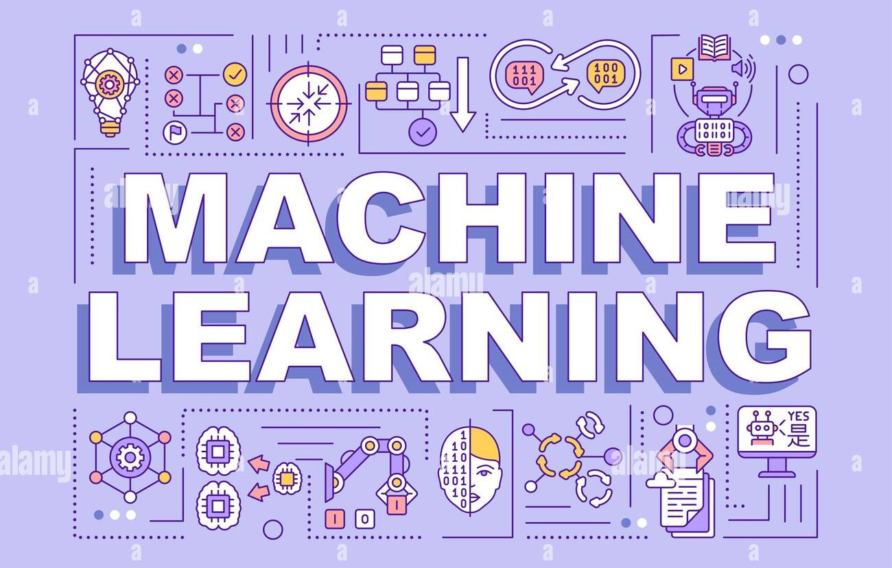

> # 🚀 Machine Learning Journey & Projects

  

  
  
  
  

> ## 👋 Overview

Welcome to my **Machine Learning Journey & Projects** repository.  
This repository documents my structured learning path in machine learning, focusing on both **theory and hands-on implementation**.

It serves as:
- 📂 A personal learning archive  
- 💼 A job-ready portfolio  
- 📖 A reference for machine learning concepts  

---

> ## 👨‍💻 About Me

I am building a strong foundation in **Machine Learning**, with emphasis on:
- Data preprocessing and feature engineering  
- Model training, evaluation, and optimization  
- Ensemble learning techniques  
- Writing clean, reusable ML pipelines  

This repository evolves as my skills grow.

---

> ## 🧠 Skills & Topics Covered

### 1. Machine Learning Fundamentals
- Simple Linear Regression  
- Multiple Linear Regression  
- Polynomial Regression  
- Logistic Regression  
- Regression & Classification Evaluation Metrics  

### 2. Data Preprocessing & Feature Engineering
- Missing Value Imputation  
- Handling Data Inconsistencies  
- Outlier Detection  
- Data Discretization  
- Feature Scaling  
- Encoding Categorical Variables  
- Feature Construction  
- Data Transformations  
- Column Transformers  

### 3. Model Validation & Optimization
- Cross Validation  
- Hyperparameter Tuning  
- Handling Imbalanced Data  

### 4. Supervised Learning Algorithms
- K-Nearest Neighbors (KNN)  
- Decision Tree  
- Naive Bayes  
- Support Vector Machine (SVM)  

### 5. Regularization Techniques
- Ridge Regression  
- Lasso Regression  
- Elastic Net Regularization  
- 
### 6. Unsupervised Learning
- K-Means Clustering  
- Agglomerative Hierarchical Clustering  
- DBSCAN  
- Principal Component Analysis (PCA)  

### 7. Ensemble Learning
- Bagging  
- Voting Ensemble  
- Random Forest  
- Gradient Boosting  
- AdaBoost  
- XGBoost  
- Blending  
- Stacking  

### 8. Pipelines & Best Practices
- Machine Learning Pipelines  
- End-to-End Model Workflows  

---

> ## 🛠️ Tech Stack

**Languages & Libraries**
- Python  
- NumPy  
- Pandas  

**Visualization**
- Matplotlib  
- Seaborn  
- MLxtend
- Plotly

**Machine Learning**
- Scikit-learn  
- XGBoost  

---

> ### 🚧 Future Work

- Add real-world projects
- Experiment tracking
- Deployment basics

----

> ### 🤝 Connect

If you’re a recruiter, hiring manager, or fellow learner, feel free to explore this repository.

⭐ If you find it useful, consider giving it a star.

**
 <i>Learning machine learning is a journey — this repository captures mine.</i> 
**